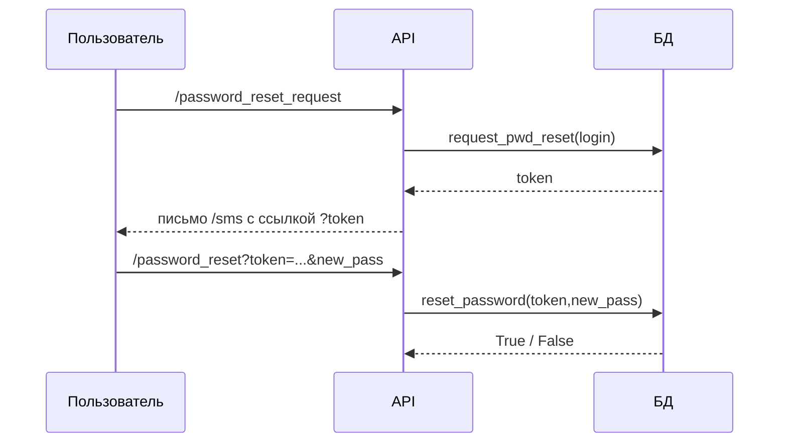

# Документация модуля `db_core`
Версия: 2025-05-10

## Назначение
`db_core` — минималистичный асинхронный слой доступа к базе SQLite, предназначенный для систем управления пользователями. Архитектура построена на **единой глобальной очереди** и **одном потребителе‐воркере**, что устраняет гонку данных и упрощает масштабирование кода.

## Схема данных
```sql
-- Таблица пользователей
CREATE TABLE users(
    login            TEXT PRIMARY KEY,          -- e‑mail, уникален
    full_name        TEXT,                      -- ФИО
    iin              TEXT UNIQUE DEFAULT '',    -- ИИН (может быть пуст)
    pwd              TEXT NOT NULL,             -- bcrypt‑хеш пароля
    phone            TEXT UNIQUE,               -- номер телефона
    role             TEXT,                      -- текстовая роль
    created_at       TEXT DEFAULT CURRENT_TIMESTAMP,
    last_login_at    TEXT,
    email_confirmed  INTEGER DEFAULT 0,         -- 0|1
    phone_confirmed  INTEGER DEFAULT 0,         -- 0|1
    failed_logins    INTEGER DEFAULT 0,         -- счётчик ошибок
    is_blocked       INTEGER DEFAULT 0          -- блокировка после MAX_FAILED
);

-- Таблица токенов сброса паролей
CREATE TABLE reset_tokens(
    token      TEXT PRIMARY KEY,
    login      TEXT,
    expires_at TEXT
);
```

## Архитектура
* **`asyncio.Queue`** — создаётся один раз в модуле, доступ через `get_queue()`.  
* **`DBWorker`** — потребитель; исполняется в фоне, выполняет SQL‑операции в пуле потоков.  
* **`DBProducer`** — лёгкий фасад; публикует задачи в очередь и дожидается результата через `Future`.

Благодаря этому любой код, даже в разных модулях, использует **общую очередь** и не вступает в конфликт при записи.

## Публичные методы класса `DBProducer`

| Метод | Описание | Аргументы | Возврат |
|-------|----------|-----------|---------|
| `add_user` | Создать пользователя | `login, password, full_name, phone, role='', iin=''` | `True` при успехе или `Exception` |
| `get_user` | Получить все поля по `login` | `login` | `tuple | None` |
| `del_user` | Удалить пользователя | `login` | `True` |
| `set_role` | Изменить роль | `login, role` | `True` |
| `update_password` | Сменить пароль (bcrypt‑хеш внутри) | `login, new_password` | `True` |
| `update_contacts` | Обновить `phone`, `iin` и/или `full_name` | ключевые аргументы | `True` |
| `check_free` | Проверить занятость реквизитов | `login, phone, iin` (любые) | `dict` с bool |
| `auth` | Авторизация + учёт счётчика ошибок | `login, password` | `bool` |
| `confirm_email` | Пометить почту подтверждённой | `login` | `True` |
| `confirm_phone` | Пометить телефон подтверждённым | `login` | `True` |
| `request_pwd_reset` | Сгенерировать токен на 30 мин | `login` | `token:str` |
| `reset_password` | Применить токен и новый пароль | `token, new_password` | `True|False` |
| `unblock` | Сбросить блокировку/счётчик | `login` | `True` |
| `backup` | Создать копию БД в каталоге `backups/` | `note=''` | `Path` |

### Поведение `auth`
1. Проверка существования пользователя.  
2. Если `is_blocked = 1` → `False`.  
3. Сравнение bcrypt‑хеша.  
4. При успехе обнуляется `failed_logins`, пишется `last_login_at`.  
5. При неудаче счётчик `failed_logins += 1`; если ≥ `MAX_FAILED` (по умолчанию 5) → `is_blocked = 1`.

### Сброс пароля


## Использование в приложении
```python
import asyncio
from db_core import DBWorker, DBProducer

async def main():
    asyncio.create_task(DBWorker().run())     # стартуем воркер, во всем коде только один воркер
    db = DBProducer()                         # создаём продюсер

    # пример добавления
    await db.add_user(
        login="bob@example.com",
        password="QwErTy!",
        full_name="Боб Карпов",
        phone="+77005550101",
        role="user"
    )

    # авторизация
    ok = await db.auth(login="bob@example.com", password="QwErTy!")
    print(ok)

asyncio.run(main())
```

## Резервные копии
`backup(note)` копирует файл базы в `backups/YYYYMMDD_HHMMSS_<note>.db`.  
При отсутствии основной базы воркер может восстановить **самый свежий** дамп.

## Константы
* `MAX_FAILED = 5` — число неверных паролей до блокировки  
* `TOKEN_LIFETIME = 30 мин` — срок действия токена сброса


# Документация модуля `refresh_token_core`
Версия: 2025-05-15

## Назначение

`refresh_token_core` — самодостаточный асинхронный слой работы с таблицей `refresh_tokens`, предназначенной для безопасного хранения и ротации refresh-токенов в системах аутентификации JWT. Построен на той же архитектуре, что и `db_core`: **глобальная очередь** задач и **один воркер-потребитель**, что полностью устраняет гонки данных.

## Схема данных

```sql
-- Таблица refresh-токенов
CREATE TABLE refresh_tokens(
    token_id    TEXT  PRIMARY KEY,      -- JTI или случайный UUID
    user_id     INTEGER,                -- FK → users.uuid
    expires_at  TEXT,                   -- ISO-8601 UTC
    is_revoked  INTEGER DEFAULT 0,      -- 0 | 1
    FOREIGN KEY(user_id) REFERENCES users(uuid)
);
```

## Архитектура

```
┌────────────┐   put(Task)   ┌──────────────┐  SQL через  to_thread()  ┌───────────┐
│ RTProducer │──────────────▶│ asyncio.Queue│─────────────────────────▶│ SQLite WAL│
└────────────┘   Future      └──────────────┘            ▲             └───────────┘
             ▲                                         commit()
             │               ← set_result() ────────────┘
         await XXX()
```

* `RTProducer` публикует задачи в очередь `_QUEUE` и ждёт результат через `Future`.
* `RTWorker` (единственный во всём приложении) последовательно извлекает задачи, выполняет SQL в пуле потоков `asyncio.to_thread`, и завершает `Future`.

## Публичные методы класса `RTProducer`

| Метод                    | Описание                                        | Аргументы                                         | Возврат                                 |        |
| ------------------------ | ----------------------------------------------- | ------------------------------------------------- | --------------------------------------- | ------ |
| `set_user_token`         | Создать или обновить запись токена (idempotent) | `token_id, user_id, expires_at, is_revoked=False` | `True`                                  |        |
| `add_refresh_token`      | Вставить новый токен (ошибка при конфликте PK)  | `user_id, token_id, expires_at`                   | `True`                                  |        |
| `get_refresh_token`      | Получить полную запись                          | `token_id`                                        | \`tuple                                 | None\` |
| `is_token_revoked`       | Проверить флаг `is_revoked`                     | `token_id`                                        | `bool` (`True`, если запись не найдена) |        |
| `revoke_refresh_token`   | Пометить токен отозванным                       | `token_id`                                        | `True`                                  |        |
| `purge_expired_tokens`   | Удалить все записи `expires_at < now()`         | —                                                 | `True`                                  |        |
| `rotate_refresh_token`   | Отозвать старый, вставить новый                 | `old_token_id, new_token_id, new_expires_at`      | `True`                                  |        |
| `get_user_tokens`        | Список всех токенов пользователя                | `user_id`                                         | `list[tuple]`                           |        |
| `revoke_all_user_tokens` | Массовый отзыв пользователя                     | `user_id`                                         | `True`                                  |        |
| `validate_refresh_token` | Проверка токена на подлинность, срок и отзыв    | `token_id, user_id`                               | `bool`                                  |        |
| `cleanup_revoked_tokens` | Очистить отозванные, старше `retention` секунд  | `retention_period`                                | `True`                                  |        |

### Поведение основных операций

*`add_refresh_token`*
Если `token_id` уже существует — SQLite поднимет `IntegrityError`; используйте `set_user_token`, чтобы перезаписывать.

*`rotate_refresh_token`*

1. `is_revoked=1` для `old_token_id`.
2. Вставка строки для `new_token_id` с тем же `user_id`, новым `expires_at`.
3. Операция атомарна: выполняется в одной транзакции.

*`validate_refresh_token`*

```
ok =  (user_id совпадает)
   && (is_revoked == 0)
   && (expires_at > now())
```

Если запись не найдена → `False`.

*`cleanup_revoked_tokens`*
Удаляет записи, помеченные `is_revoked=1` и имеющие `expires_at < now()-retention_period`.

## Использование вместе с `flask_jwt_extended`

```python
from flask_jwt_extended import (
    create_refresh_token, decode_token, get_jwt_identity
)
import datetime, asyncio
from refresh_token_core import RTProducer, RTWorker
from db_core import DBProducer, DBWorker

async def issue_refresh(user_uuid: int):
    # 1. создаём JWT
    full_jwt = create_refresh_token(identity=user_uuid)

    # 2. извлекаем служебные поля
    decoded = decode_token(full_jwt, allow_expired=True)
    token_id = decoded["jti"]
    expires  = datetime.datetime.utcfromtimestamp(decoded["exp"]
              ).isoformat(sep=" ", timespec="seconds")

    # 3. кладём в базу
    rt = RTProducer()
    await rt.add_refresh_token(user_uuid, token_id, expires)

    return full_jwt
```

## Пример минимального сценария

```python
import asyncio, secrets, datetime
from db_core import DBWorker, DBProducer
from refresh_token_core import RTWorker, RTProducer

async def main():
    asyncio.create_task(DBWorker().run())
    asyncio.create_task(RTWorker().run())
    db = DBProducer()
    rt = RTProducer()

    # регистрируем пользователя и получаем uuid
    uid = await db.add_user(
        login="bob@example.com",
        password="P@ssw0rd",
        full_name="Боб",
        phone="+77005550101"
    )

    # выдаём refresh-токен
    tok = secrets.token_urlsafe(32)
    exp = (datetime.datetime.utcnow()
           + datetime.timedelta(days=30)
           ).isoformat(sep=" ", timespec="seconds")
    await rt.add_refresh_token(uid, tok, exp)

    print("валиден?", await rt.validate_refresh_token(tok, uid))  # True
    await rt.revoke_refresh_token(tok)
    print("валиден после отзыва?", await rt.validate_refresh_token(tok, uid))  # False

    # удаляем просроченные
    await rt.purge_expired_tokens()

    await asyncio.sleep(0.1)

asyncio.run(main())
```

## Внешняя очередь

Для записи вне `refresh_token_core.py`

```python
from refresh_token_core import get_rt_queue
q = get_rt_queue()
print("в очереди", q.qsize(), "задач")
```

## Константы

В модуле нет фиксированных порогов, вся политика задаётся аргументами методов (`retention_period`, `new_expires_at`). Никакой бизнес-логики с лимитами попыток не зашито, поэтому интеграция с любыми OAuth/JWT-провайдерами прозрачна.
